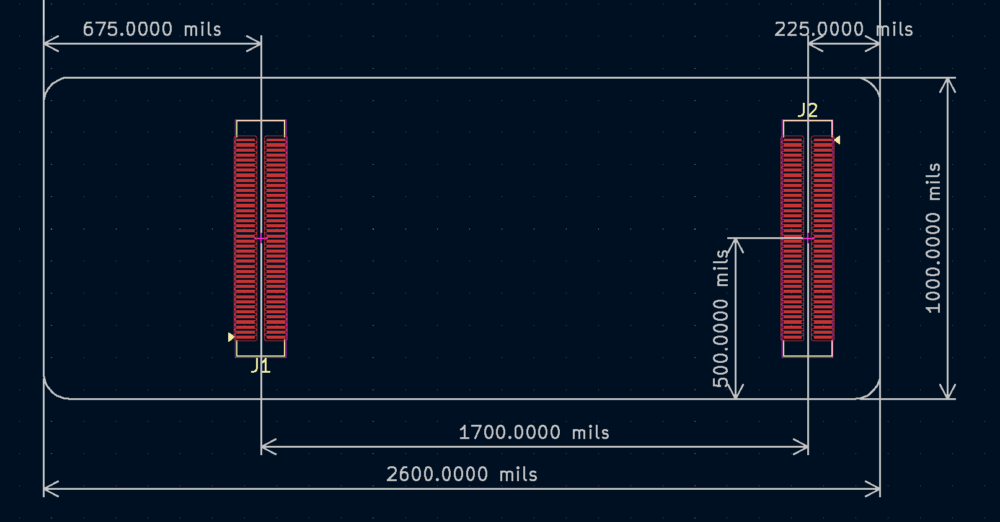

Shulltronics Carrier Board for Arduino Portenta x8
=================================================
### By Carsten Thue-Bludworth, 2023

This repo contains the KiCad files for my Arduino Portenta x8 Carrier Board.

See [this](https://github.com/arduino/portentax8-stm32h7-fw/issues/3?notification_referrer_id=NT_kwDOAtAYCLM1NDEyNjE1Nzk1OjQ3MTkyMDcy#issuecomment-1404136639) issue for a more in-depth discussion on the pinouts of the high-density connectors.

TODO list:
[ ] - Verify HDC mechanical dimensions with Arduino team
[ ] - Everything else...

*This project is licensed under the CERN Open-Hardware License version 2.0*
